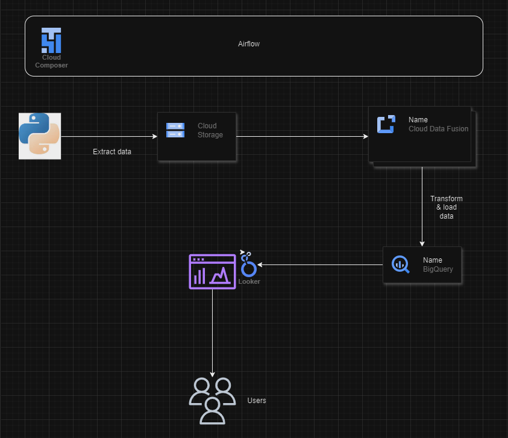

# GCP_ETL_Project

First, we create a fake employee dataset with Python with the help of the Faker library.
We then upload the dataset to a Google Cloud Storage bucket using the same Python program.
We use Wrangler in Data Fusion to concatenate columns and mask Personal Identifiable Information (PII).
We then send the resulting table to BigQuery and create a report in Looker.

Finally, we automate the workflow using Apache Airflow in Cloud Composer.
